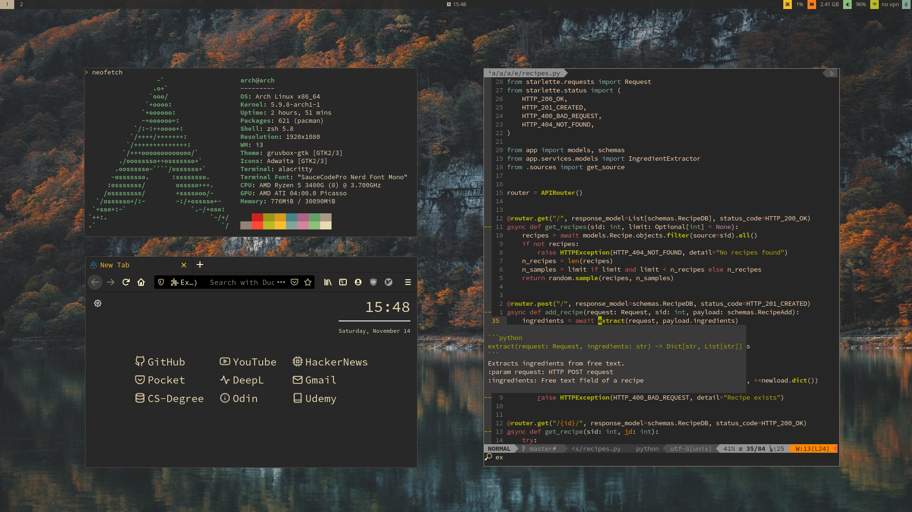

# Dotfiles

**Warning:** Use at your own risk. This repository is adapted to work with arch + i3 WM.



## Install

### Prerequisite

Fresh install of Arch and i3. Average Linux User has a nice guide:

- Video: https://www.youtube.com/watch?v=UiYS8xWFXLY
- Article: https://averagelinuxuser.com/a-step-by-step-arch-linux-installation-guide/

Clone repository and submodules:

```shell
$ git clone https://github.com/logan-connolly/dotfiles.git
$ cd dotfiles
$ git submodule init
$ git pull --recurse-submodules
```

Install yay for downloading AUR:

```shell
$ git clone https://aur.archlinux.org/yay.git
$ cd yay && makepkg -si
```

Install siji via https://github.com/stark/siji in order to get icons in polybar:

```shell
$ mkdir ~/.local/share/fonts
$ git clone https://github.com/stark/siji.git ~/.local/share/fonts
$ cd ~/.local/share/fonts/siji
$ ./install.sh
```

### Configuration

Install packages and create symlinks for configurations using the `./install.sh` script

## Post Install

### System service fails

Check if any of the system services failed to start with `$ sudo systemctl --failed`

### Disable GRUB delay

Edit `/etc/default/grub` adding to `GRUB_FORCE_HIDDEN_MENU="true"` to file. Then create file `/etc/grub.d/31_hold_shift` with the contents from this [gist](https://gist.githubusercontent.com/anonymous/8eb2019db2e278ba99be/raw/257f15100fd46aeeb8e33a7629b209d0a14b9975/gistfile1.sh) in order to get grub menu by holding shift during startup.

To activate it, you need to make the file executable and regenerate the grub configuration:

```shell
$ sudo chmod a+x /etc/grub.d/31_hold_shift
$ sudo grub-mkconfig -o /boot/grub/grub.cfg
```

## Gists

### Permissions

Set restricted permissions for files and directories:

```bash
# Find all directories in home directory and set 755 permission
$ find $HOME -type d -exec chmod 755 {} +

# Find all files in home directory and grant only file creator write privs
$ find $HOME -type f -exec chmod 644 {} +
```

### Syncing

Sync two directories locally:

```bash
# Backup home directory to mounted external drive
rsync -avzh --delete $HOME /mnt/backup/
```

### Encrypt Drive

Encrypt drive partition with luks via [Average Linux User](https://www.youtube.com/watch?v=ch-wzDyo-wU):

```
# Find out which drive you want to encrypt with (for this example let's say sdb1)
$ sudo fdisk -l

# Set up encrypted drive with password [CAUTION: Drive will be wiped]
$ sudo cryptsetup --verbose --verify-passphrase luksFormat /dev/sdb1

# Unlock encrypted device using given password
$ sudo cryptsetup luksOpen /dev/sdb1 sdb1

# Check that you see device mapped to /dev/mapper/sdb1
$ sudo fdisk -l

# Create filesystem for storing data and remove overhead files
$ sudo mkfs.ext4 /dev/mapper/sdb1
$ sudo tune2fs -m 0 /dev/mapper/sdb1

# Make directory where you want to mount and mount to it
$ sudo mkdir /mnt/encrypted
$ sudo mount /dev/mapper/sdb1 /mnt/encrypted

# Optional: change file permissions to current user
$ sudo chown -R `whoami`:users /mnt/encrypted

# Optional: create test file
$ touch test.txt /mnt/encrypted

# Unmount device and close connection
sudo umount /dev/mapper/sdb1 && sudo cryptsetup luksClose sdb1
```

### Packages

Remove unused packages and configurations (orphans):

```bash
$ sudo pacman -Rns $(pacman -Qtdq)
```

Export installed packages in system:

```bash
$ sudo pacman -Qqen > pkglist.txt
```

Setup system service to consistently get fastest package mirrors:

```
# /etc/xdg/reflector/reflector.conf

--save /etc/pacman.d/mirrorlist
--country Germany
--protocol https
--latest 5
--sort age
```

To enable, run: `$ sudo systemctl enable --now reflector.service`

Add color to pacman by editing `/etc/pacman.conf`:

```shell
# /etc/pacman.conf
COLOR
```
