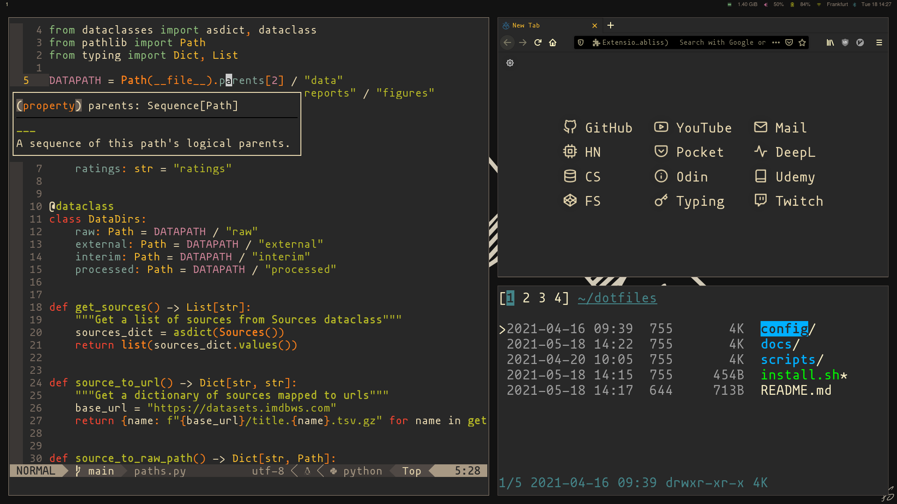
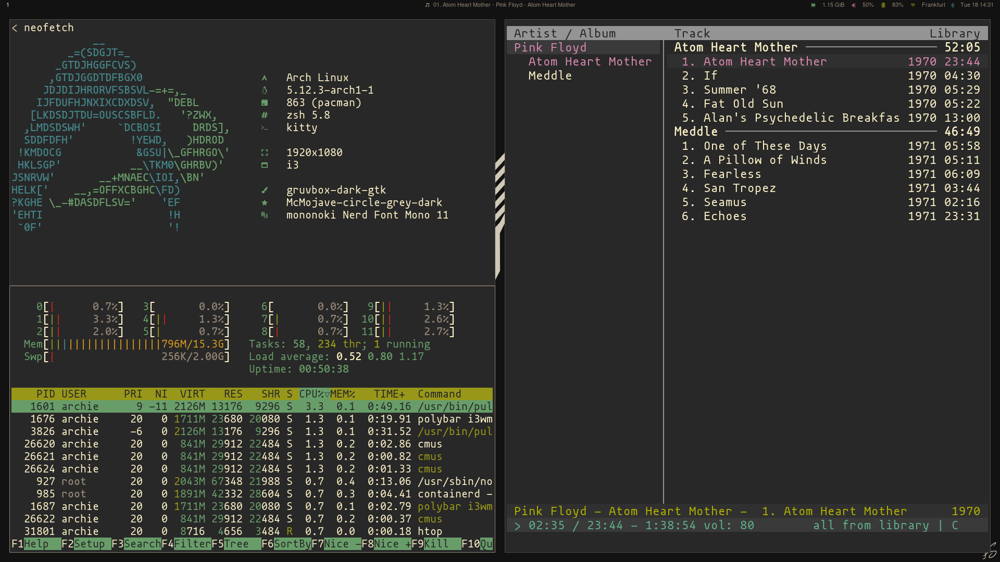

# Dotfiles





## Prerequisites

Fresh install of [arch](https://archlinux.org/) and [i3](https://i3wm.org/). Official Guide and Average Linux User article and video:

- https://wiki.archlinux.org/index.php/installation_guide
- https://averagelinuxuser.com/a-step-by-step-arch-linux-installation-guide/

## Installation

**Warning:** use at your own risk.

Clone [dotfiles](https://github.com/logan-connolly/dotfiles) repository:

```shell
git clone https://github.com/logan-connolly/dotfiles.git
```

Install needed dependencies and create symbolic links to `~/.config`:

```shell
./install.sh
```

Build and install nightly `neovim` from source:

```shell
./scripts/install-neovim.sh
```
