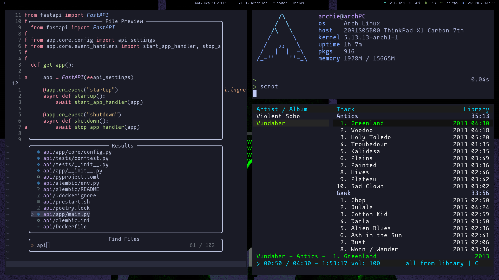

# My Dotfiles

**Warning:** use at your own risk.



## Prerequisites

### Arch

Fresh install of [arch](https://archlinux.org/) using [arch bootstrap repo](https://github.com/logan-connolly/bootstrap-arch).

Additional Resources for installing Arch:

- https://wiki.archlinux.org/index.php/installation_guide
- https://averagelinuxuser.com/a-step-by-step-arch-linux-installation-guide/


## Installation

```shell
# Clone dotfiles repo
git clone https://github.com/logan-connolly/dotfiles.git && cd dotfiles

# Install system and desktop environment dependencies through pacman
make install pkg_file=scripts/pacman/system.pkglist
make install pkg_file=scripts/pacman/gnome.pkglist

# Clone repos that cannot be installed by pacman
make clone

# Install neovim from source and add plugins through paq
make neovim
make paq

# Link configurations to target destinations
make config
```
